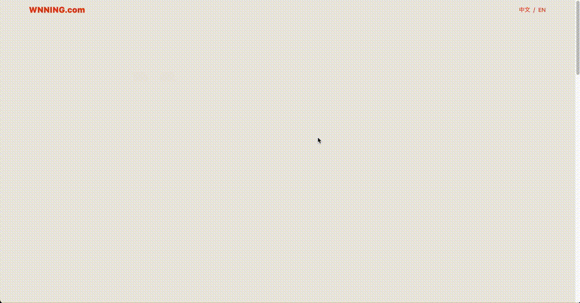

<h1 align="center"> Hi there 👋 I'm Dolly Chen. </h1>
<h4 align="center"> I'm a passionate Front-End Developer specializing in dynamic, responsive web applications using React.js and Vue.js. </h4>

My passion lies in delivering seamless and intuitive user experiences. With a well-rounded skill set in full-stack development, I focus on building high-performance and user-friendly interfaces while ensuring smooth interaction between front-end and back-end systems.

<h4 align="center">👉 Check out my latest website, built with React.js and deployed on AWS Amplify:
  <a href="https://www.wnning.com">Wnning.com 👀</a>
</h4> 

  

<h4 align="center">👉 Explore my 
  <a href="https://dollychen-cyc.github.io/portfolio/#/home">Portfolio</a>, showcasing projects from the early stages of my development career:
</h4> 

  

<h4 align="center">👉 If you're interested in my experience, feel free to view my 
  <a href="https://github.com/DollyChen-CYC/DollyChen-CYC/blob/main/src/doc/Resume_DollyChen(%E9%99%B3%E5%84%80%E7%92%9F).pdf">Resume</a>.
</h4>

<h2> 🛠️ Skills </h2>

- **Front-End**: JavaScript (ES6+), HTML5, CSS3, Sass/SCSS, React.js, Vue.js, Responsive Web Design (RWD), Axios, Data Visualization tools, CSS-in-JS, Bootstrap
- **Back-End**: Node.js, Express.js, Handlebars, Mongoose (MongoDB), Sequelize ORM, MySQL, Python
- **Others**: Electron.js, Git (Version Control), RESTful API, Postman, Figma

<h4> Frameworks </h4>

<h4> How to reach me </h4>

